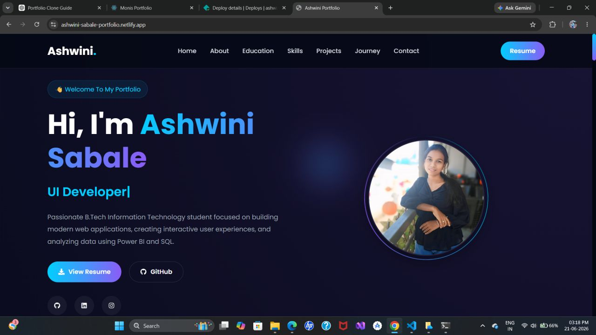

# Ashwini Sabale

### Software Engineer • Data Analyst • Problem Solver

> "Building products with clean code and meaningful data."

 

 

---

# 🚀 Live Portfolio

> **Visit Here:**
> **[https://lnkd.in/dNsEZvec](https://ashwini-sabale-portfolio.netlify.app/)**

---

# 📸 Portfolio Preview

---

# ✨ Features

✅ Modern UI Design

✅ Fully Responsive

✅ Smooth Animations

✅ Project Showcase

✅ Skills Section

✅ About Me

✅ Resume Download

✅ Certifications

✅ Contact Form

✅ Fast Performance

---

# 🛠 Tech Stack

---

# 📂 Website Sections

* 🏠 Home
* 👩‍💻 About
* 💡 Skills
* 🚀 Projects
* 📜 Certifications
* 📄 Resume
* 📬 Contact

---

# 🎯 Purpose

This portfolio represents my learning journey, technical projects, certifications, and continuous growth in software development and data analytics.

My goal is to build impactful applications while constantly improving my programming, analytical, and problem-solving skills.

---

# 📈 Future Improvements

* Dark/Light Mode
* Blog Section
* AI Chat Assistant
* Project Filtering
* More Interactive Animations
* Performance Optimization

---

# 🤝 Connect With Me

---

### ⭐ If you like this portfolio, consider giving it a Star!

